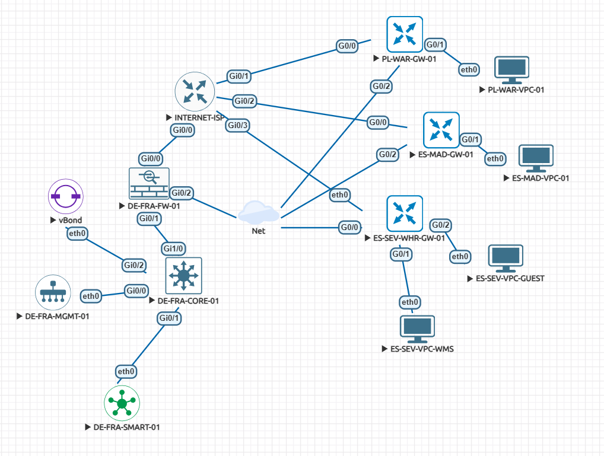

# Cisco SD-WAN & NFV Network Modernization

**Bachelor Thesis Engineering Project / Выпускной инженерный проект**  
**Research of SDN & NFV IT Technologies in Cisco Corporate Networks**

A portfolio-oriented enterprise network modernization case study built around **Cisco SD-WAN**, **SDN**, **NFV**, logical simulation, and an **EVE-NG digital twin**.

> This public repository contains the engineering artifacts of the project. **The full bachelor thesis text/PDF is intentionally private and is not published here.**

## Project Goal

The project evaluates how a geographically distributed enterprise network can move away from device-by-device CLI administration toward centralized policy, virtualization and automated WAN operations.

The engineering workflow is:

1. identify operational and architectural weaknesses;
2. design a Cisco-based SDN/NFV target architecture;
3. validate addressing, routing, segmentation and resiliency concepts;
4. build a practical Cisco SD-WAN laboratory in EVE-NG;
5. compare the proposed approach using technical and economic KPIs.

## Architecture

The academic case study focuses on four key European locations:

- **DE-FRA - Frankfurt:** core and management/control infrastructure;
- **PL-WAR - Warsaw:** branch office;
- **ES-MAD - Madrid:** regional site;
- **ES-SEV - Sevilla:** warehouse / WMS scenario.

The exported EVE-NG snapshot contains Cisco SD-WAN/Viptela control components, WAN Edge nodes, an ASAv security VNF, ISP/underlay simulation and endpoint nodes.



## Design vs. Implementation

The defended project is broader than the exported EVE-NG snapshot. Cisco Catalyst Center/DNA Center, Cisco ISE, SGT-based microsegmentation, ENCS/NFVIS, NETCONF/YANG, ZTP and Hybrid-WAN concepts are part of the wider design and research scope.

The public repository therefore uses four evidence levels:

```text
Designed / researched
        ↓
Logically modeled
        ↓
Implemented in EVE-NG
        ↓
Measured / evidenced
```

See [`docs/IMPLEMENTATION_STATUS.md`](./docs/IMPLEMENTATION_STATUS.md) for the current technical boundary.

## Reported Project Results

The defense materials report these academic case-study values:

- **SD-WAN failover:** ~850 ms;
- **ZTP onboarding:** 22 min measured / target <30 min;
- **security isolation scenario:** 3.8 s;
- **OPEX reduction:** ~40%;
- **ROI:** 28%;
- **payback period:** 1.4 years;
- **estimated annual economic effect:** ~€422,000.

These are project-specific thesis results, not generic Cisco benchmarks. Before the final tagged portfolio release, every public headline value must either be linked to publishable evidence or clearly marked as a thesis-derived case-study result.

## Repository Structure

```text
Cisco-SDN-NFV-Modernization-Project/
├── README.md
├── LICENSE
├── analytics/
│   ├── README.md
│   └── case-study/
├── configs/
│   ├── README.md
│   └── snapshots/
├── docs/
│   ├── IMPLEMENTATION_STATUS.md
│   ├── PUBLICATION_CHECKLIST.md
│   └── presentation/
│       ├── README.md
│       └── Thesis_Defense_Presentation.pdf
├── evidence/
│   └── README.md
└── lab/
    └── eve-ng/
        ├── README.md
        ├── NetCore_SDN_Project.unl
        └── topology.png
```

### `lab/eve-ng/`

The current EVE-NG laboratory snapshot and its topology image. Cisco appliance images are not distributed.

### `configs/snapshots/`

Original text configuration exports preserved for analysis. They are explicitly marked as snapshots because the audit found parameter differences between some text exports and the `.unl` startup state.

### `evidence/`

The destination for reproducible command output, failover measurements, control-plane state, connectivity checks, security validation and ZTP evidence.

### `analytics/case-study/`

Supporting academic case-study documents for infrastructure assessment, verification and efficiency analysis.

### `docs/presentation/`

Browser-friendly PDF of the defense presentation. The full thesis document is not included.

## Reproducing the Lab

Cisco virtual appliance images are proprietary and intentionally absent. A user reproducing this project must supply appropriately licensed images in their own EVE-NG environment.

Recommended validation flow:

```text
Import .unl topology
        ↓
Provide licensed Cisco images
        ↓
Start underlay and SD-WAN components
        ↓
Verify control connections / OMP / BFD
        ↓
Verify branch reachability and policies
        ↓
Run controlled failure tests
        ↓
Save raw evidence in evidence/
```

Do not treat the configuration snapshots as a ready-to-deploy canonical configuration set until the reconciliation items in `docs/IMPLEMENTATION_STATUS.md` are closed.

## Public Presentation

The defense presentation is available here:

[`docs/presentation/Thesis_Defense_Presentation.pdf`](./docs/presentation/Thesis_Defense_Presentation.pdf)

## Publication Scope

**Not published:**

- full bachelor thesis PDF;
- thesis ODT/DOCX source;
- complete thesis text;
- Cisco proprietary software images;
- credentials, private keys or secrets.

**Published:**

- architecture and lab topology;
- EVE-NG definition;
- sanitized configuration snapshots;
- reproducible evidence as it is validated;
- academic case-study summaries;
- defense presentation;
- implementation notes and limitations.

## Status

The repository is currently being cleaned and reconciled on the `portfolio-cleanup` branch before a reviewed `v1.0-thesis-portfolio` release. The main priorities are one consistent topology, sanitized configs, evidence traceability and consistent technical/economic claims.

## Responsible Use

For education, research and authorized laboratory use only. Cisco names and trademarks belong to their respective owners. Proprietary Cisco software is not distributed here.

## Author

**Dzmitry Shypilau**  
*Research of SDN & NFV IT Technologies in Cisco Corporate Networks*

## License

Repository-authored source materials are published under the [MIT License](./LICENSE), excluding third-party trademarks and proprietary software.
